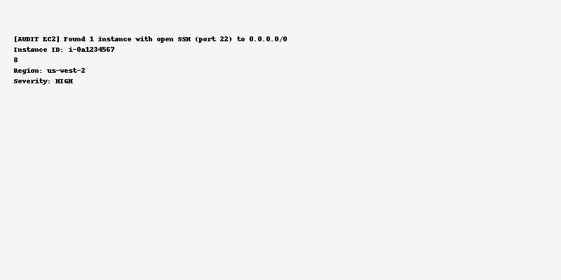
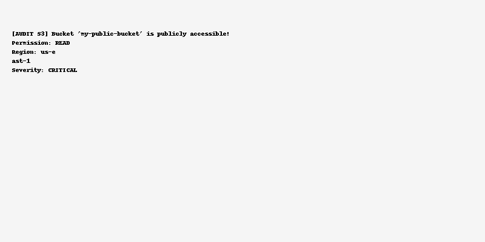
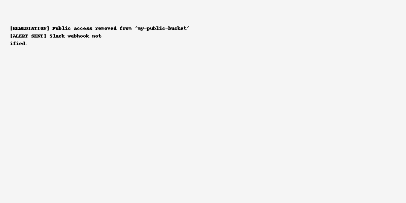
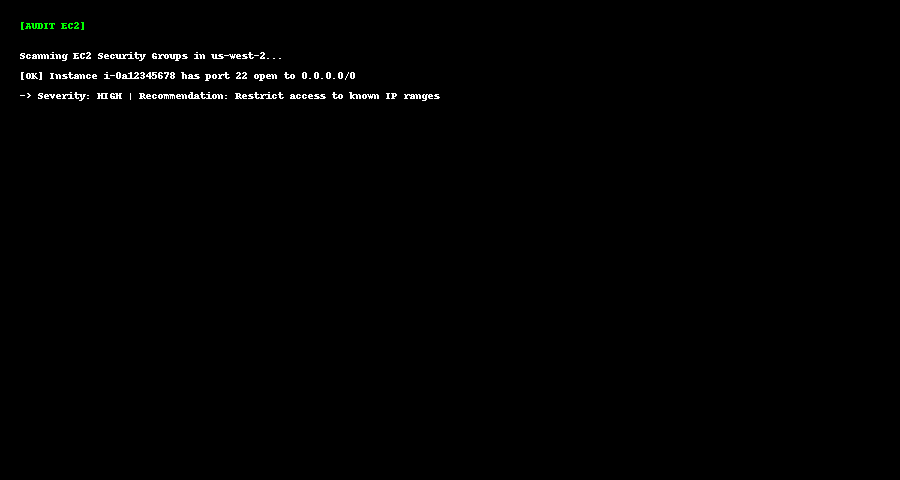
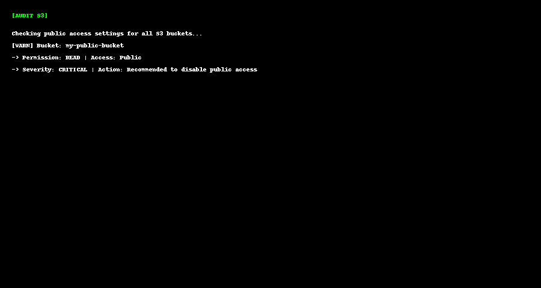
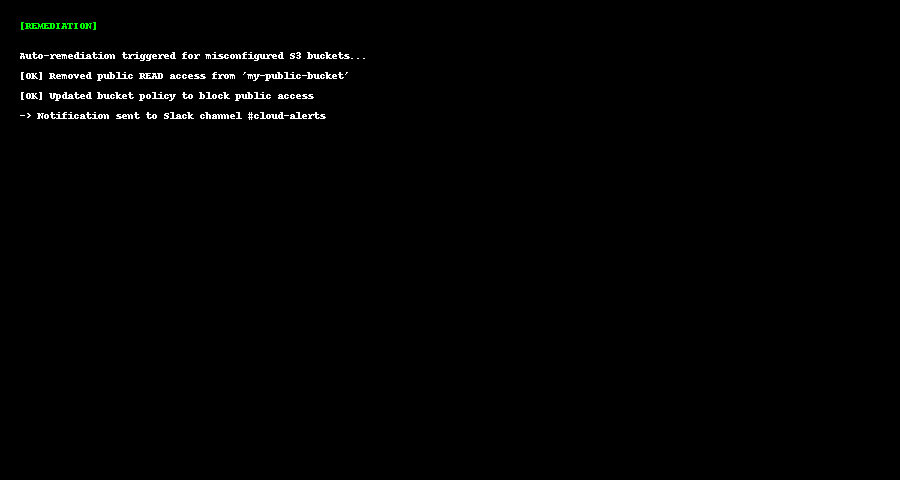

# Cloud Infrastructure Compliance Auditor & Auto-Remediator (CICAR)

This tool scans AWS resources (EC2, S3, IAM) for misconfigurations and optionally triggers remediation.

# Cloud Infrastructure Compliance Auditor & Auto-Remediator (CICAR)

This tool scans AWS resources (EC2, S3, IAM) for misconfigurations and optionally triggers remediation.

---

## 📸 Sample Output Screenshots

### EC2 Audit Result

### S3 Bucket Misconfiguration

### Remediation + Alert

---

## 📸 Real Output Screenshots

### EC2 Audit Output

### S3 Public Access Alert

### Auto-Remediation + Slack Notification

